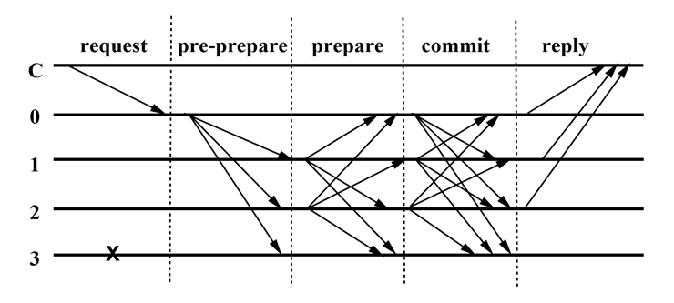

# Practical Byzantine Fault Tolerance

PBFT는 네트워크 오류 및 신뢰할 수 없는 서버로부터 전체 서버의 Liveness와 Safety를 보장하는 분산 합의 알고리즘이다. 
Liveness는 클라이언트의 요청을 처리해 줄 수 있음을 보장하는 것 이고, Safety는 해당 시스템이 정상적으로 합의과정을 이행함을 의미한다.

## 목표
1. 수신받은 메시지를 저장할 Logger 클래스를 구현한다.
2. 정상 작동을 가정한 ***Normal-Case Operation***을 구현한다.
3. Primary의 비정상 작동을 고려한 ***View Change***단계를 구현한다.
4. Log를 특정 stable checkpoint마다 정리할 수 있도록 ***Garbage Collection***을 구현한다.

## Convention
* 작업은 issue 단위로 진행한다.
    * 각 이슈는 dev/\<issue number\>/simple description 형태로 branch를 생성하여 작업 후 master에 병합한다.
    * 병합시에는 close/fix등의 키워드를 커밋 메시지에 삽입하여 해당 이슈를 자동으로 닫도록 한다. * 커밋시에는 다음과 같은 형식의 메시지를 취한다.
> This is a commit header
>   
> This is a commmit body. You can describe as you want.
 
    * 제목의 첫 글자는 대문자이고, 제목에는 온점을 달지 아니함에 유의한다.
* 완료된 issue는 Pull Request를 사용하여 병합한다.
    * Master branch에 병합하기 전에 peer-review를 거침으로써 코드를 한번 더 검증하기 위함
* intellij를 이용하여 commit을 할 시에
    * Reformat code
    * Rearrange code
    * Optimize imports
    * Cleanup을 사용한다.
    
## Reference
1. Practical Byzantine Fault Tolerance - <http://www.read.seas.harvard.edu/~kohler/class/cs239-w08/castro99practical.pdf>
